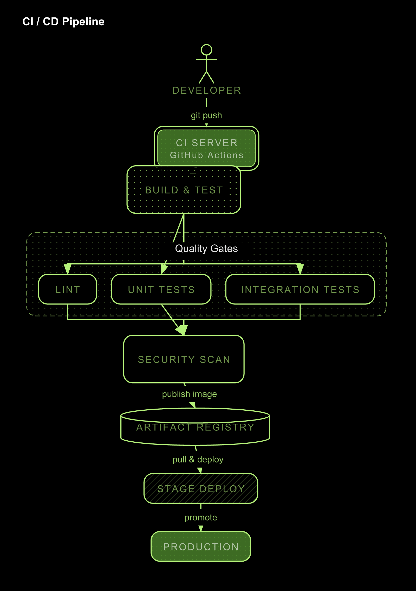
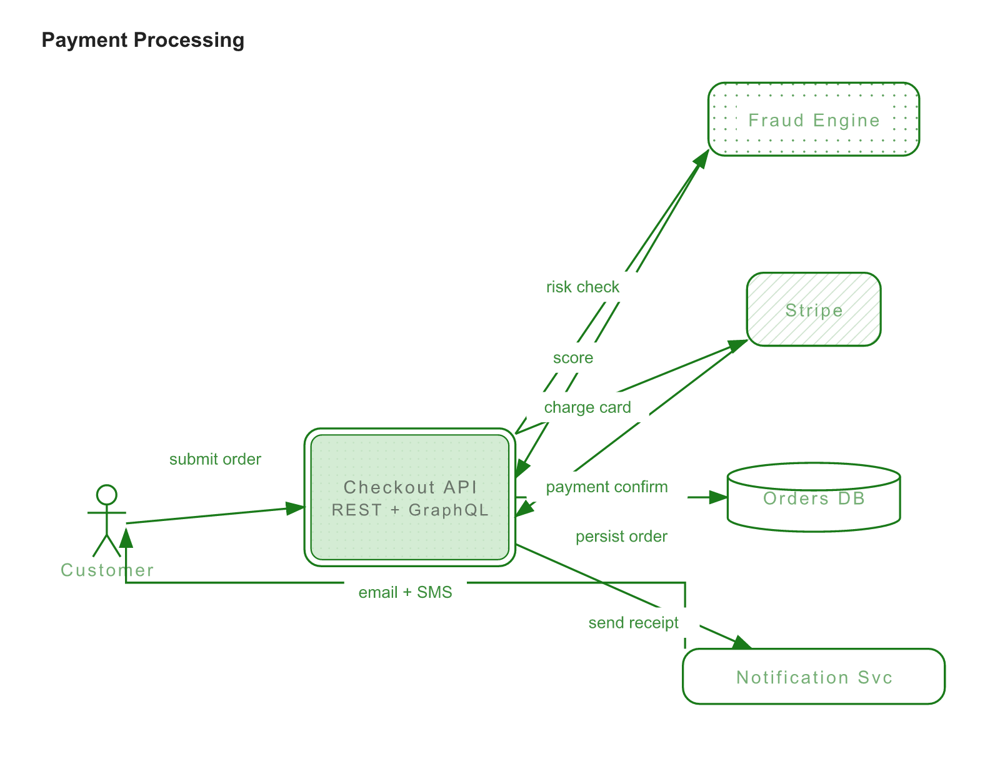

# n9tgraph

A beautiful, opinionated diagramming DSL and renderer. Write `.n9` diagram source, get SVG or PNG output.

Supports **flow**, **sequence**, and **card** diagram types with automatic layout, subgraphs, annotations, dark/white themes, and custom accent colors.

## Examples

### CI / CD Pipeline (dark theme, top-to-bottom)



```
type flow
title "CI / CD Pipeline"
direction TB

actor Developer
service "CI Server" {fill: hero, sublabel: "GitHub Actions"}
component "Build & Test" {fill: dotgrid}
component "Security Scan"
component "Stage Deploy" {fill: crosshatch}
external "Production" {fill: hero}
datastore "Artifact Registry"

subgraph "Quality Gates" {fill: dotgrid, border-style: dashed}
  component Lint
  component "Unit Tests"
  component "Integration Tests"
end

DEVELOPER --> CI_SERVER : git push
CI_SERVER --> BUILD_TEST
BUILD_TEST --> LINT
BUILD_TEST --> UNIT_TESTS
BUILD_TEST --> INTEGRATION_TESTS
LINT --> SECURITY_SCAN
UNIT_TESTS --> SECURITY_SCAN
INTEGRATION_TESTS --> SECURITY_SCAN
SECURITY_SCAN --> ARTIFACT_REGISTRY : publish image
ARTIFACT_REGISTRY --> STAGE_DEPLOY : pull & deploy
STAGE_DEPLOY --> PRODUCTION : promote
```

### Payment Processing (white theme, left-to-right)



```
type flow
title "Payment Processing"
theme white
direction LR

actor Customer
service "Checkout API" {fill: hero, sublabel: "REST + GraphQL"}
component "Fraud Engine" {fill: dotgrid}
external "Stripe" {fill: crosshatch}
datastore "Orders DB"
component "Notification Svc"

CUSTOMER --> CHECKOUT_API : submit order
CHECKOUT_API --> FRAUD_ENGINE : risk check
FRAUD_ENGINE --> CHECKOUT_API : score
CHECKOUT_API --> STRIPE : charge card
STRIPE --> CHECKOUT_API : payment confirm
CHECKOUT_API --> ORDERS_DB : persist order
CHECKOUT_API --> NOTIFICATION_SVC : send receipt
NOTIFICATION_SVC --> CUSTOMER : email + SMS
```

## MCP Server Install

### Claude Code (recommended)

```bash
claude mcp add --scope user --transport stdio n9tgraph -- npx -y n9tgraph
```

### Claude Desktop

Add to your `claude_desktop_config.json`:

```json
{
  "mcpServers": {
    "n9tgraph": {
      "command": "npx",
      "args": ["-y", "n9tgraph"]
    }
  }
}
```

### Cursor

Add to `.cursor/mcp.json`:

```json
{
  "mcpServers": {
    "n9tgraph": {
      "command": "npx",
      "args": ["-y", "n9tgraph"]
    }
  }
}
```

### MCP Tools

| Tool | Description |
|------|-------------|
| `n9t.render` | Parse and render `.n9` source to SVG or PNG. Returns dimensions, aspect ratio, node/edge counts, and layout warnings. |
| `n9t.render-ascii` | Render a diagram from grid-based JSON layout with n9tgraph styling. Use for precise control over node positioning. Supports custom `accentColor`. |
| `n9t.validate` | Validate `.n9` source without rendering. Returns parse errors, warnings, and diagram statistics. |
| `n9t.grammar` | Get the full `.n9` DSL grammar reference, examples, node kinds, fill patterns, arrow types, and properties. |

## CLI Usage

```bash
# Render .n9 file to SVG (stdout)
npx n9tgraph-cli examples/ci-deploy-pipeline.n9

# Render to PNG file
npx n9tgraph-cli examples/ci-deploy-pipeline.n9 -f png -o output.png

# Watch mode
npx n9tgraph-cli examples/ci-deploy-pipeline.n9 -o output.svg --watch
```

## Quick DSL Example

```
type flow
title "API Architecture"
direction LR

service "API Gateway" {fill: hero}
component "Auth Service"
datastore "User DB"

API_GATEWAY --> AUTH_SERVICE : validate token
AUTH_SERVICE --> USER_DB : lookup user
```

See the `examples/` directory for more.

## Development

```bash
npm install
npm run build
```

## License

MIT
